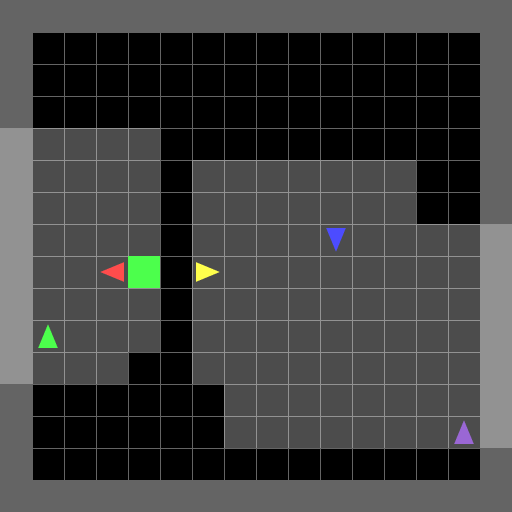

# Adding the GIFs section to the README.md content

updated_readme_content = """# 🚀 Mobile Multi-Robot Navigation using RL

This repository is designed for **mobile multi-robot navigation** using **Reinforcement Learning (RL)**. It supports both **single-agent** and **multi-agent** training in **MiniGrid** and **MultiGrid** environments using the [SKRL framework](https://github.com/Toni-SM/skrl).

We provide implementations of **IPPO (Independent PPO)** and **MAPPO (Multi-Agent PPO)** to train and evaluate agents in grid-based navigation tasks.

---

## 🚀 Features
✅ **Supports IPPO & MAPPO** via SKRL  
✅ **Centralized & Decentralized Policies** for MARL  
✅ **Custom Environment Wrappers** for Observation/State Processing  
✅ **Training & Evaluation Scripts** for RL Agents  

---

## 📜 Script Descriptions

### **🔹 MiniGrid (Single-Agent) Scripts**
| **Script** | **Description** |
|------------|---------------|
| `minigrid_PPO_train.py` | Trains a **single-agent PPO** policy in a MiniGrid environment. |
| `minigrid_PPO_test.py` | Evaluates the trained MiniGrid PPO agent and logs performance metrics. |
| `minigrid_extractor.py` | Custom feature extractor for both MiniGrid and MultiGrid environments. |

### **🔹 MultiGrid (Multi-Agent) Scripts**
| **Script** | **Description** |
|------------|---------------|
| `multigrid_env.py` | Custom environment wrappers for using MultiGrid in SKRL. |
| `multigrid_envs_test.py` | Tests the MultiGrid environment setup and observation spaces. |
| `multigrid_IPPO_train.py` | Trains an **IPPO (Independent PPO) agent** for MultiGrid environments. |
| `multigrid_IPPO_test.py` | Evaluates the trained **IPPO agent** to measure navigation performance. |
| `multigrid_MAPPO_train.py` | Trains a **MAPPO (Multi-Agent PPO) agent** for centralized multi-agent learning. |
| `multigrid_MAPPO_test.py` | Tests the trained **MAPPO** policy for multi-agent navigation. |

---

## **🔹 Single-Agent (MiniGrid)**
| **Demo** | **Description** |
|----------|---------------|
|  | Demonstration of a trained **PPO agent** in MiniGrid. |

## **🔹 Multi-Agent (MultiGrid)**
| **Demo** | **Description** |
|----------|---------------|
|  | Trained **IPPO agents** navigating in MultiGrid. |
|  | Trained **MAPPO agents** collaborating in MultiGrid. |